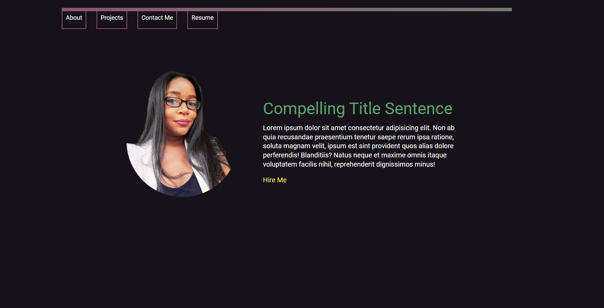

# My Portfolio Website
[](https://app.netlify.com/sites/karenportfolio/deploys)

## Live Site
[View the Live Site](https://karenthedeveloper.com/)


# Description
Welcome to my portfolio website! This platform serves as a comprehensive showcase of my professional journey, highlighting my skills, experiences, and projects. Crafted with React, it offers a dynamic and intuitive user experience.

At the heart of this website is my resume section, where you can delve into my academic background, work history, and skill set. Whether you're interested in my educational achievements, past employment, or technical proficiencies, you'll find everything you need to know to understand my professional profile.


## Built With
- JavaScript
- React
- React Router
- Vite
- HTML5
- CSS
- SMTP Server
- Node.js
- Express
- Figma

 ## Instructions
 
 To download node packages in client directory:
```bash
npm i
```
To start Porfolio Website in client directory:
```bash
npm run dev

```
To start SMTP Server in server directory:
```bash
npm run start

```

## Author

- LinkedIn: [@KarenDouglas](https://www.linkedin.com/in/karen-douglas-344974246/)
- Frontend Mentor: [@KarenDouglas](https://www.frontendmentor.io/profile/KarenDouglas)
- Twitter: [@CodeNoob4Life](https://twitter.com/CodeNoob4Life)
